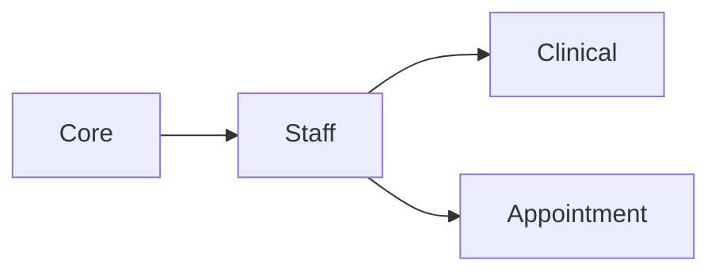

# Staff module

**In one sentence:** The Staff module is the **people directory for caregivers and employees**—who works here, in which departments, with which roles, and with which professional credentials (licenses, registrations) on file.

## Why this module exists

Patient care is delivered by **named individuals** (doctors, nurses, lab techs, reception). The hospital must track **employment status**, **where someone works**, **what they are allowed to do**, and **whether their license is current**. Staff links those real-world facts to the same **user accounts** that log into the system, so permissions and schedules make sense.

## Where Staff fits in FlowRise

- **Depends on Core** for branches, departments, locations, and the shared user model.
- **Clinical and Appointment** flows assume staff (often modeled as providers or employees) exist when documenting encounters, assigning care, or booking time.

## What you can do with it (everyday language)

- Create and maintain **staff profiles** (name, employment type, status).
- Record **credentials** (license numbers, issuing body, expiry, verification state).
- Assign staff to **departments** and mark a **primary department** when someone works in more than one area.
- Track **specialties** or skills relevant to routing work (for example, cardiology vs. lab).
- Support **HR-style workflows** (activation, deactivation, audit-friendly updates) without deleting history.

## How it works (simple)

1. HR or an administrator opens the **Staff** area in the admin app.
2. They enter or update profile, assignment, and credential data.
3. **Services** encapsulate rules (search, assignment changes, credential updates).
4. Other modules reference the same staff record when they need to know **who performed** an action or **who is eligible** to fulfill a task.

## What is inside this folder (high level)

| Path | Purpose |
|------|---------|
| `app/Models/` | Staff, credentials, department links, specialties. |
| `app/Classes/Services/` | CRUD, search, assignments—business logic. |
| `app/Filament/` | Staff resources, forms, relation managers (credentials, departments). |
| `app/Policies/` | Authorization for viewing or editing staff data. |
| `app/Events/`, `app/Notifications/` | Lifecycle hooks and alerts (for example, around verification). |
| `database/migrations/` | Tables for staff-related data. |

## Dependencies

- **Core** (see `module.json` `requires`).

Module rollout overview: [Module status](../../docs/shared/module-status.md).

## Further reading

- **Implementation plan:** [docs/implementation-plan.md](docs/implementation-plan.md)
- **User-facing intro:** [Staff management](../../docs/user-guide/staff-management.md)

## For developers

- **Namespace:** `Modules\Staff\...`
- **Service provider:** `Modules\Staff\Providers\StaffServiceProvider`
- **FHIR alignment:** the implementation plan describes how staff maps to industry-standard **Practitioner** concepts for interoperability; you do not need to know FHIR to use the screens.
- **Tests:** `tests/` inside this module; run selectively from the repo root.
