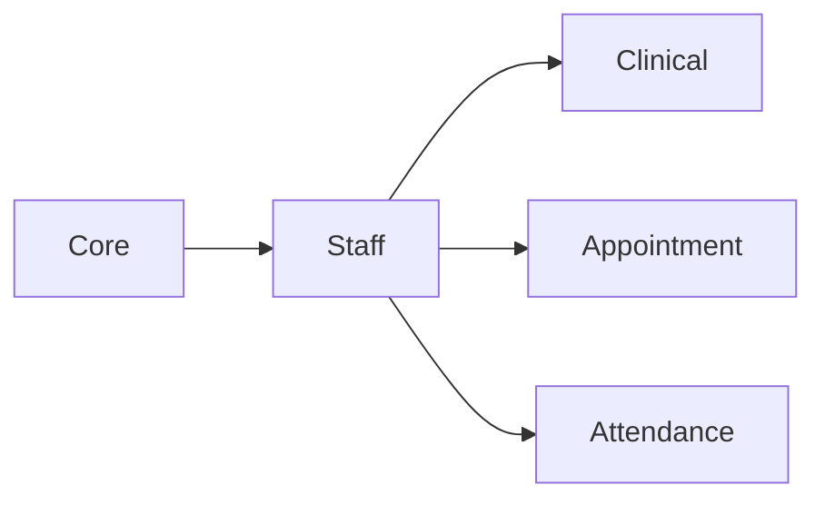

# Staff module

**In one sentence:** The Staff module is the **people directory for caregivers and employees**—who works here, in which departments, with which roles, and with which professional credentials (licenses, registrations) on file.

## Why this module exists

Patient care is delivered by **named individuals** (doctors, nurses, lab techs, reception). The hospital must track **employment status**, **where someone works**, **what they are allowed to do**, and **whether their license is current**. Staff links those real-world facts to the same **user accounts** that log into the system, so permissions and schedules make sense.

## Where Staff fits in FlowRise

- **Depends on Core** for branches, departments, locations, and the shared user model.
- **Clinical and Appointment** flows assume staff exist when documenting encounters, assigning care, or booking time.
- **Attendance** maps biometric badges via `zk_user_id` on staff.
- **FHIR module** exposes Practitioner and PractitionerRole resources via Staff transformers (`/api/v1/fhir/Practitioner`, `/api/v1/fhir/PractitionerRole`).

```mermaid
flowchart LR
  Core[Core]
  Staff[Staff]
  Clinical[Clinical]
  Appointment[Appointment]
  Attendance[Attendance]
  Core --> Staff
  Staff --> Clinical
  Staff --> Appointment
  Staff --> Attendance
```

## What you can do with it (everyday language)

- Create and maintain **staff profiles** (name, employment type, status, hire date, ZK badge id) under **Operations → Staff**.
- Record **credentials** (license numbers, issuing body, expiry, verification state, uploaded document).
- Assign staff to **departments** and mark a **primary department** when someone works in more than one area.
- Track **specialties** or skills relevant to routing work (for example, cardiology vs. lab), with certificate uploads.
- Create and manage the staff member's **login account** (create, manage, reset password, resend credentials email) and print a **staff ID card**.
- Support **HR-style workflows** (Update Status: active, inactive, on leave, suspended, terminated, pending verification) without deleting history.

## How it works (simple)

1. HR or an administrator opens the **Staff** area in the admin app.
2. They enter or update profile, assignment, and credential data.
3. **Services** encapsulate rules (search, assignment changes, credential updates).
4. Other modules reference the same staff record when they need to know **who performed** an action or **who is eligible** to fulfill a task.

## What is inside this folder (high level)

| Path | Purpose |
|------|---------|
| `app/Models/` | `Staff`, `StaffCredential`, `StaffDepartment`, `StaffSpecialty`. |
| `app/Classes/Services/` | `StaffService`, `StaffSearchService`, `StaffAssignmentService`, `StaffCredentialService`, `StaffAccountService` (user account creation, credentials email, password reset). |
| `app/Classes/Fhir/` | `FhirPractitionerTransformer`, `FhirPractitionerRoleTransformer` (full CRUD through the FHIR module). |
| `app/Filament/` | `StaffCluster` (Operations group), `StaffResource` (list/create/view/edit/activities), relation managers (Credentials, Departments, Specialties), `StaffExporter`. |
| `app/Http/` | `StaffIdCardController` (`GET /staff/{staff}/id-card`), REST API controllers (`/api/v1/staff`, `/api/v1/staff/{staff}/credentials`; registered when the Api module is enabled). |
| `app/Policies/` | `StaffPolicy`. |
| `app/Events/`, `app/Notifications/` | `StaffRegistered/Updated/Deactivated/Reactivated`, `CredentialVerified/Rejected/Renewed/Expired`; `StaffCredentialsNotification`. |
| `app/Enums/` | `StaffType`, `EmploymentStatus`, `CredentialType` (24 values), `CredentialStatus`. |
| `database/migrations/` | 6 migrations (staff, staff_credentials, staff_departments, staff_specialties, `zk_user_id`, ...). |

## Dependencies

- **Core** (see `module.json` `requires`).

Module rollout overview: [Module status](../../docs/shared/module-status.md).

## Further reading

- **Implementation record:** [docs/implementation-plan.md](docs/implementation-plan.md)
- **User-facing intro:** [Staff management](../../docs/user-guide/staff-management.md)

## For developers

- **Namespace:** `Modules\Staff\...`
- **Service provider:** `Modules\Staff\Providers\StaffServiceProvider`
- **FHIR alignment:** the implementation plan describes how staff maps to industry-standard **Practitioner** concepts for interoperability; you do not need to know FHIR to use the screens.
- **Custom permission:** `print_staff_id`. Staff numbers are generated as `STF-<year>-<sequence>` by `Staff::generateStaffNumber()` (the Core `staff_prefix` setting is not read).
- **Tests:** `php artisan test --compact Modules/Staff/tests` (17 test files).
